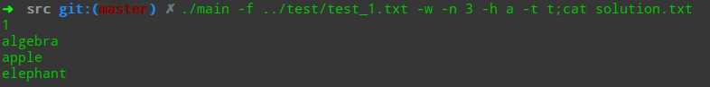
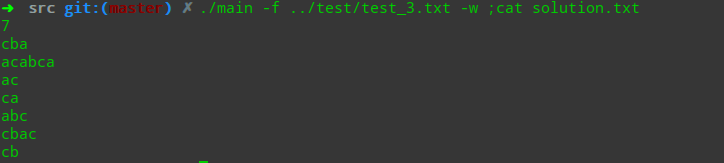
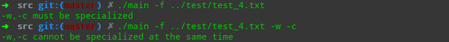
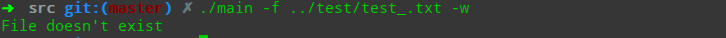
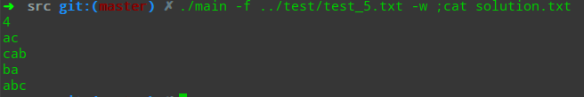

# 最长单词链报告

命令行方式的使用方式见`README.md`

## 基本算法

### 核心

核心思想是：将最长单词链问题转化成在加权有向图上寻找最长路径问题。

基本方法是：DFS搜索。

### 详细

26个字母相当于26个结点，每条边都代表了一个单词，有向则标示了单词的首尾。比如`egg`在图中表示为`e-->g`.

对于每种参数，需要特别设定不同图和搜索方式，下面详细说明。

#### `-w -c`

这两者的区别在于加权的不同，`-w`表示权重为1, 而`-c`表示权重为单词的长度。比如`egg`在`-c`中权重为3而在`-w`中权重为1.

#### `-h`

在没有`-h`的搜索中，需要从26个节点的每一个开始搜索才能找到符合要求的，而标示了`-h`则只需要从相应指定的节点开始搜索。

#### `-t`

在表示了`-t`的搜索中，如果其他要求都满足了，则需要额外检查末尾的节点是否是指定的节点，如果不是则报错。

#### `-n`

标示了`-n`相当于是在使用深度受限的DFS, 每次小于n就继续深入，等于n如果同时满足其他条件就记录并返回，大于n就直接返回。

## 关键代码截图

## 测试案例的设计思想

### `test_1.txt`

测试各种参数是否正常，`-f -w -c -n -h -t`

测试`-w`

测试`-c`

测试`-w -h`

测试`-w -t`

测试`-w -n`

测试`-c -n`

测试`-w -n -h -t -h `

### `test_2.txt`

测试文件中没有单词或者单词数量为1时的异常。

### `test_３.txt`

测试当文件中很多其他字符时候的单词提取是否正常

### `test_４.txt`

对参数异常的处理,相应的异常包括

没有指定`-f`，异常。

`-c -w`没有指定或者指定了两个，异常。

文件不存在，异常。

### `test_5.txt`

测试单词存在环的情况，不会循环。

### `test_6.txt`

测试单词存在自环情况，不会循环。

### `test_7.txt`

测试存在重复单词，会自动清除。

### `test_8.txt`

测试文件中仅有字母，没有单词的情况

### `test_9.txt`

测试大文件的输入，对于`-w`,本文件大小为997B.

### `test_10.txt`

测试大文件，对于`-n`

对于更大的文件，由于输出太多，会导致内存崩溃。

## 附加需求

### 运行环境

界面部分使用Qt 5.9.7编写，在`GUI/lib`目录下提供了exe程序运行所需的依赖库。

另外，由于Qt本身的限制，如果要编译这个项目，项目所在的路径不能含有中文字符。

### 界面截图

### 使用说明

most words单选框：最多单词数量。

most letters单选框：最多字母数量。

head letter文本框：指定单词链的开头，只能输入一个字母(其他字符无法输入)，空则认为不指定开头。

tail letter文本框：指定单词链的结尾，只能输入一个字母(其他字符无法输入)，空则认为不指定结尾。

number文本框：指定单词链的单词数量，只能输入一个数(其他字符无法输入)，空则认为不指定单词数量。

file按钮：从本地导入待检测的文件，会覆盖已经在左上角文本框中的文本。

save按钮：将检测结果保存到本地文件。

clear按钮：清除当前检测的文本和检测结果。

check按钮：开始检测当前文本。

左上角文本框：输入待检测的文本，可以直接输入，也可以从本地文件导入。

左下角文本框：输出检测结果。

### 使用截图

**一次检测**

指定开头，最多单词数量

**异常情况**

这是没有输入的异常，还有其他一些异常，例如待检测文本中单词太少、未指定最多单词数量还是字母数量等，不再列出。

**提示信息**

鼠标悬停在按钮或标签上面会有提示信息（这个不知道怎么截图）。