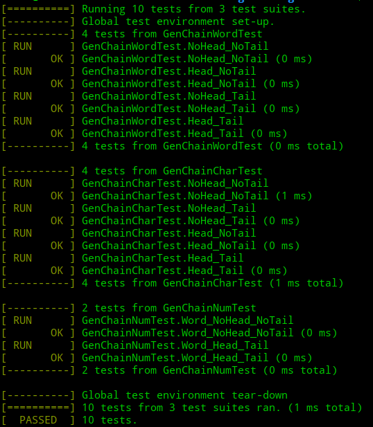
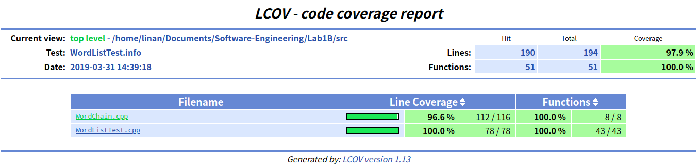
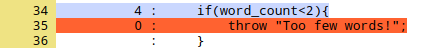

# 最长单词链说明文档

## 接口的实现

基本方法：封装成一个类，使用静态函数，就可以直接调用而不需要先定义一个对象。

类定义为：

```cpp
class Core{
    private:
        static void DFS(   int index, 
                    std::vector<int>&current_path,
                    char specific_tail,unsigned specific_num,
                    std::vector<std::pair<int,std::vector<int>>> &result,int depth);

        static std::vector<std::pair<int,std::vector<int>>> maxLength(std::vector<std::string>text,std::map<std::string,int>word2id,bool w_or_c,
                                char specific_head,char specific_tail,
                                unsigned specific_num);

    public:
        //如果传入 0，表示没有约束
        //假定单词都是小写的，且不重复，不做任何额外检查
        //head,tail=='\0'表示无约束
        static int gen_chain_word(char* words[], int len, char* *&result,char head, char tail);
        static int gen_chain_char(char* words[], int len, char* *&result,char head, char tail);
        static int gen_chain_num(char* words[], int len, char* **&result,char head, char tail,int num,int *&result_num);
};
```

具体的实现上，由于PartA就已经是使用很统一的接口，

```cpp
string LWC(bool w_or_c,string text_original,unsigned specific_num,char specific_head,char specific_tail);
```

所以封装做的主要工作就是为不同的调用方式提供不同的函数，内部使用的函数为

```cpp
static std::vector<std::pair<int,std::vector<int>>> maxLength(std::vector<std::string>text,std::map<std::string,int>word2id,bool w_or_c,
                                char specific_head,char specific_tail,
                                unsigned specific_num);
```

依然是很统一的接口，具体的实现也就是改相应的参数调用。

使用方式如下

```cpp
static int gen_chain_word(c);
static int gen_chain_char(char* words[], int len, char* *&result,char head, char tail);
static int gen_chain_num(char* words[], int len, char* **&result,char head, char tail,int num,int *&result_num);
```

`gen_chain_word gen_chain_char`返回值都是单词链的长度，而`gen_chain_num`返回值为单词链的数量。

参数中，`char* words[], int len, char* *&result,char head, char tail`与实验文档定义的一致，而`int num`表示`-n`定义的单词数量，`int *&result_num`表示返回的一系列单词链中每个链的单词长度。

具体使用如下(`main.cpp`)

```cpp
char *words[]={"algebra","apple","zoo","elephant","under","fox","dog","moon","leaf","trick",
            "pseudopseudohypoparathyroidism"};//11

char **result1;
int len;
len=Core::gen_chain_word(words,11,result1,'\0','\0');
len=Core::gen_chain_char(words,11,result1,'\0','\0');

char ***result2;
int *result2_num;
len=Core::gen_chain_num(words,11,result2,'\0','\0',2,result2_num);
```

## 单元测试

只列出部分测试样例：

### gen_chain_word

```C++
TEST(GenChainWordTest,NoHead_NoTail)
{
    char *words[] = {"algebra","apple","zoo","elephant","under","fox","dog","moon",
                     "leaf","trick","ka"};
    char **result;
    char *realResult[5] = {"algebra","apple","elephant","trick","ka"};
    int len = Core::gen_chain_word(words,11,result,'\0','\0');
    ASSERT_EQ(len,5);
    for(int i = 0; i < 5; i++)
        EXPECT_STREQ(result[i],realResult[i]);
}
```

该测试用于检验求最多单词个数的最长单词链。测试数据考虑程序能否避免生成环（如单词`algebra`、`ka`）。

### gen_chain_char

```C++
TEST(GenChainCharTest,NoHead_Tail)
{
    char *words[] = {"algebra","apple","zoo","elephant","under","fox","dog","moon",
                   "leaf","trick","pseudopseudohypoparathyroidism"};
    char **result;
    char *realResult[2] = {"pseudopseudohypoparathyroidism","moon"};
    int len = Core::gen_chain_char(words,11,result,'\0','n');
    ASSERT_EQ(len,34);
    for(int i = 0; i < 2; i++)
        EXPECT_STREQ(result[i],realResult[i]);
}
```

该测试用于检验最多字母个数的最长单词链，同时指定单词结尾。测试数据考虑程序能否正确处理最多字母个数这个目标（单词`pseudopseudohypoparathyroidism`）。

### gen_chain_num

```C++
TEST(GenChainNumTest,Word_NoHead_NoTail)
{
    char *words[] = {"algebra","apple","zoo","elephant","under","fox","dog","moon",
                     "leaf","trick","pseudopseudohypoparathyroidism"};
    char ***result;
    int *len;
    int resultNum = Core::gen_chain_num(words,11,result,'\0','\0',3,len);
    char *realResult[2][3] = {{"algebra","apple","elephant"},{"apple","elephant",
                             "trick"}};
    ASSERT_EQ(resultNum,2);
    for(int i = 0; i < 2; i++)
    {
        ASSERT_EQ(len[i],3);
        for(int j = 0; j < 3; j++)
            EXPECT_STREQ(result[i][j],realResult[i][j]);
    }
}
```

该测试用于检验指定单词个数的单词链搜索。测试数据考虑程序能否找出所有符合条件的单词链。

## 单元测试结果



可以看出，`WordChain.cpp`文件的覆盖率达到96.6%。没有覆盖到的是如下4条异常处理语句，我没有做这方面的测试。

