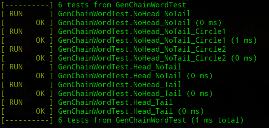
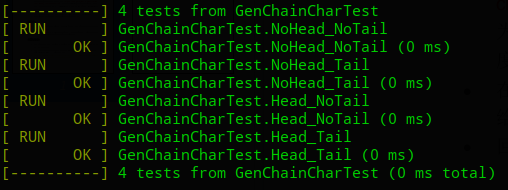
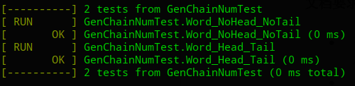

# 最长单词链说明文档

## 1. 文本处理的实现

在上一个实验的基础上增加

```cpp
int Core::text_preprocess(string filename,char **&words)
```

内部处理的逻辑是，先读取文件，并且处理文件不存在的异常

```cpp
ifstream t(filename);
    if(!t){
        throw "File doesn't exist";
    }
    stringstream buffer;
    buffer << t.rdbuf();
    string text_original(buffer.str());
```

然后将文件中字母全部转化成小写，将其他符号变成空格，便于分割

```cpp
vector<string>text;
    set<string>text_mod;

    for(auto &c:text_original){
        if('a'<=c && c<= 'z')
            continue;
        else if('A'<=c && c<='Z'){
            c=c-'A'+'a';
            continue;
        }
        else
            c=' ';
    }
```

之后分割成单词

```cpp
size_t pos=0;
    string token;
    while((pos=text_original.find(' '))!=string::npos){
        token=text_original.substr(0,pos);
        if(token.length()!=0){
            text_mod.insert(token);
        }
        text_original.erase(0,pos+1);
    }
    if(text_original.length()!=0){
        text_mod.insert(text_original);
    }

```

最后按照返回参数的要求分配空间

```cpp
int maxL=0;
    for(auto w:text_mod){
        text.push_back(w);
        if(w.length()>maxL){
            maxL=w.length();
        }
    }

    words=(char **)malloc(sizeof(char*)*text.size());
    for(int i=0;i<text.size();i++){
        words[i]=(char *)malloc(sizeof(char)*(text[i].length()+2));
        strcpy(words[i],text[i].c_str());
    }
```

## 2. 异常处理

包括如下几个方面

1. 如果设置`-f -n -h -t`后面必须有值
2. 必须设置`-f filename`
3. `-c -w`必须设置且仅能设置一个
4. `-c -n`不能同时设置，此处鉴于甲方仅仅给出的三个实现函数，并不包含这项功能，所以禁用。
5. `-h -t`后必须是字母，大小写均可
6. 输入文件有效
7. 输入文件内的单词数至少为2或者至少为`-n`指定的数

## 3. 代码测试

### 3.1 回归测试

回归测试采用了`Lab1A`和`Lab1B`中的测试样例，故不在此列出。结果如下：

- `gen_chain_word`



- `gen_chain_char`

  

- `gen_chain_num`

  

### 3.2 文本处理测试

- `text_preprocess`

  

**回归测试和新添加的文本处理API的测试代码均在`WordChainTest.cpp`中**，覆盖率如下：


### 3.3 异常测试

1. `-f、-n、-h、-t`参数后面必须有值

   - 没有给出文件名

     

   - `-h`后面没有给出字母

     

   - `-t`后面没有给出字母

     

   - `-n`后面没有给出单词个数

     

2. 必须设置`-f filename`

   - 没有给出`-f`参数

     

3. `-c -w`必须设置且仅能设置一个

   - 没有给出`-w`或者`-c`参数

     

   - 同时给出`-w`和`-c`参数

     

4. `-c、-n`不能同时设置

   - 同时给出`-c`和`-n`参数

     

5. `-h、-t`后必须是字母

   - 指定的开头不是字母

     

   - 指定的结尾不是字母

     

6. 输入文件有效

   - 文件不存在

     

7. 输入文件中的单词数至少为2或者至少为`-n`指定的数

   - 输入文件中的单词数为1（测试文件在`test`目录下）

     

   - 输入文件中的单词数少于`-n`参数指定的数（测试文件在`test`目录下）

     


