# 最长单词链报告

## 基本算法

### 核心

核心思想是：将最长单词链问题转化成在加权有向图上寻找最长路径问题。

基本方法是：DFS搜索。

### 详细

26个字母相当于26个结点，每条边都代表了一个单词，有向则标示了单词的首尾。比如`egg`在图中表示为`e-->g`.

对于每种参数，需要特别设定不同图和搜索方式，下面详细说明。

#### `-w -c`

这两者的区别在于加权的不同，`-w`表示权重为1, 而`-c`表示权重为单词的长度。比如`egg`在`-c`中权重为3而在`-w`中权重为1.

#### `-h`

在没有`-h`的搜索中，需要从26个节点的每一个开始搜索才能找到符合要求的，而标示了`-h`则只需要从相应指定的节点开始搜索。

#### `-t`

在表示了`-t`的搜索中，如果其他要求都满足了，则需要额外检查末尾的节点是否是指定的节点，如果不是则报错。

#### `-n`

标示了`-n`相当于是在使用深度受限的DFS, 每次小于n就继续深入，等于n如果同时满足其他条件就记录并返回，大于n就直接返回。

## 关键代码截图

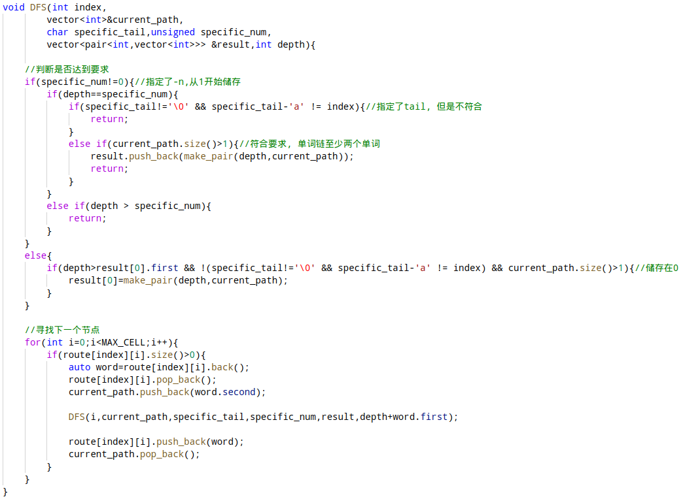

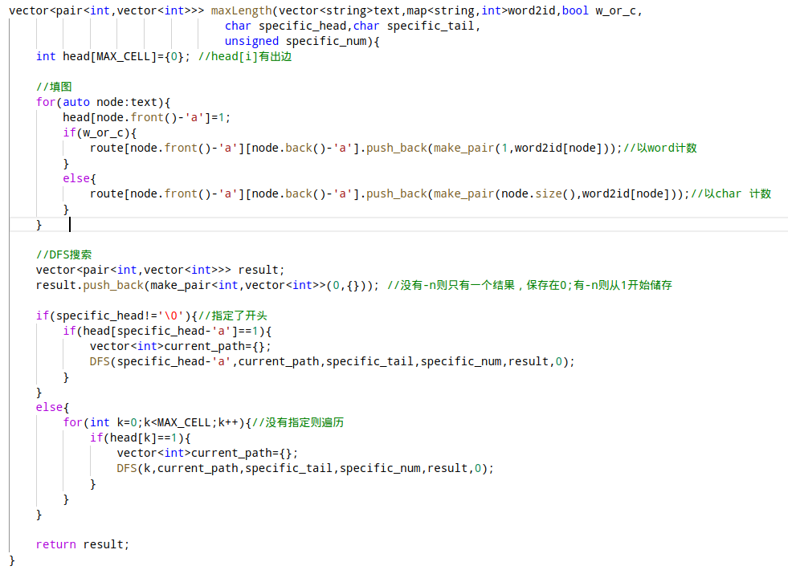

## 测试案例的设计思想

### `test_1.txt`

测试各种参数是否正常，`-f -w -c -n -h -t`

测试`-w`

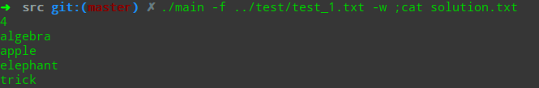

测试`-c`

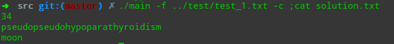

测试`-w -h`

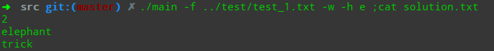

测试`-w -t`

测试`-w -n`

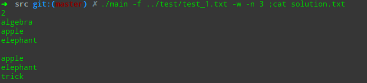

测试`-c -n`

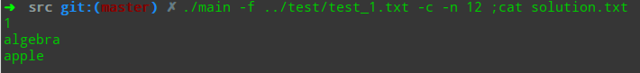

测试`-w -n -h -t -h `

### `test_2.txt`

测试文件中没有单词或者单词数量为1时的异常。

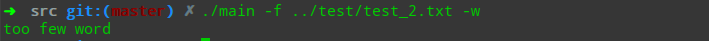

### `test_３.txt`

测试当文件中很多其他字符时候的单词提取是否正常

### `test_４.txt`

对参数异常的处理,相应的异常包括

没有指定`-f`，异常。

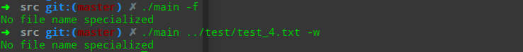

`-c -w`没有指定或者指定了两个，异常。

文件不存在，异常。

### `test_5.txt`

测试单词存在环的情况，不会循环。

### `test_6.txt`

测试单词存在自环情况，不会循环。

### `test_7.txt`

测试存在重复单词，会自动清除。

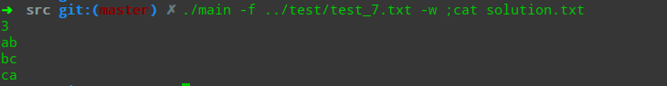

### `test_8.txt`

测试文件中仅有字母，没有单词的情况

### `test_9.txt`

测试大文件的输入，对于`-w`,本文件大小为997B.

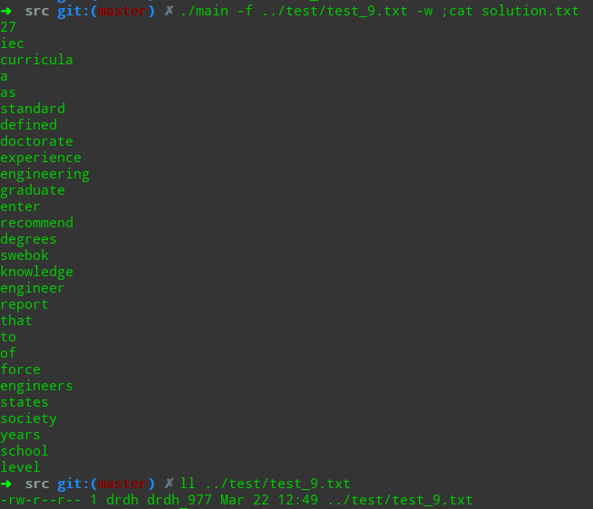

### `test_10.txt`

测试大文件，对于`-n`

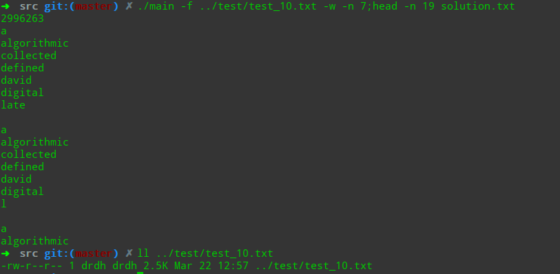

对于更大的文件，由于输出太多，会导致内存崩溃。

