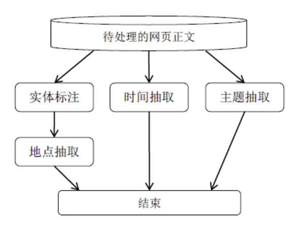

### 环境与要求

#### Java环境搭建

~~解压实验文档内的jdk与eclipse的内容安装即可~~

##### win10

###### Reference

[参考1](https://www.cnblogs.com/yangyxd/articles/5615965.html)tomcat 路径按照上面的。建maven web工程按照下面的。

[eclipse ee web maven](https://wiki.base22.com/btg/how-to-create-a-maven-web-app-and-deploy-to-tomcat-fast-27033760.html)

###### 基于maven的web project建立

a. 安装最新JDK SE

b. 再安装最新eclipse jee

c. 下载最新的tomcat解压

d. 建立最新maven project. 

| name       | value   |
| ---------- | ------- |
| Archetype  | web     |
| groupId    | cn.drdh |
| artifactId | webtt   |

目录说明

- main 目录下是项目的主要代码，test 目录下存放测试相关的代码。 
-  编译输出后的代码会放在target 目录下（该目录与 src 目录在同一级别下，这里没有显示出来）。 
-  java 目录下存放 Java 代码，resources 目录下存放配置文件。 
-  webapp 目录下存放 Web 应用相关代码。 
-  pom.xml 是 Maven 项目的配置文件

e. 然后按照[参考1](https://www.cnblogs.com/yangyxd/articles/5615965.html)即可

f. 其他内容预计可以使用maven自动下载以来

##### archlinux

```bash
yaourt eclipse-jee
```

#### 可能的参考

往期ppt知识参考

三个实验的代码（仅一个确定可参看）


#### 实验内容

##### 爬取[DBWorld](https://research.cs.wisc.edu/dbworld/browse.html)

爬虫定时抓取更新

##### 信息抽取

[Stanford CoreNLP](https://stanfordnlp.github.io/CoreNLP/) 

DBWorld网页中的地点、时间、主题等信

##### 对搜索结果进行ranking

##### 基于web的搜索引擎

[参考网页](http://dbis-group.uni-muenster.de/dbms/templates/conferences/conferences.php)

使用jsp实现简单的搜索界面

多种搜索选项，包括提交截止日期，会议起止日期，地点，主题等

#### 实验拓展

- 会议重要性
  - 根据会议重要性(参考[ccf推荐会议](https://www.ccf.org.cn/xspj/gyml/ ))排序 

- 用户相关 
  - 实现用户登录注册功能 
  - 根据用户信息，搜索结果优先返回用户领域相关文章

- 相关词搜索
- 结果多页显示




### 预备知识

#### eclipse自动import+o

```
Ctrl+Shift+o
```


#### maven

[maven那些事](https://my.oschina.net/huangyong/blog/194583)

#### 爬虫

##### 依赖

```xml
<dependency>
    <groupId>us.codecraft</groupId>
    <artifactId>webmagic-core</artifactId>
    <version>0.7.3</version>
</dependency>
<dependency>
    <groupId>us.codecraft</groupId>
    <artifactId>webmagic-extension</artifactId>
    <version>0.7.3</version>
</dependency>
```

##### 入门

[WebMagic](http://webmagic.io/docs/zh/)

[webmajic入门](https://www.cnblogs.com/justcooooode/p/7913365.html)

###### log4j配置

在resource目录下新建log4j.properties文件

```properties
log4j.rootLogger=INFO, stdout

log4j.logger.org.quartz=WARN, stdout
log4j.appender.stdout=org.apache.log4j.ConsoleAppender
log4j.appender.stdout.layout=org.apache.log4j.PatternLayout
log4j.appender.stdout.layout.ConversionPattern=%d{MM-dd HH:mm:ss}[%p]%m%n
```

###### xpath

[xpath 教程](https://zhuanlan.zhihu.com/p/29436838)

###### java文件读写

[java文件读写](https://www.cnblogs.com/qianbi/p/3378466.html)

[如何将一个Java对象写到文件里](https://blog.csdn.net/zhencheng20082009/article/details/62422678)

[java 读写json](https://www.cnblogs.com/not-NULL/p/5235378.html)

[JSONObejct 遍历](https://blog.csdn.net/changhenshui1990/article/details/69950663)

```xml
<dependency>
    <groupId>org.json</groupId>
    <artifactId>json</artifactId>
    <version>20180813</version>
</dependency>
```

[String to json in java](https://stackoverflow.com/questions/5245840/how-to-convert-jsonstring-to-jsonobject-in-java)

###### java 集合

[Java中的Set集合类](https://my.oschina.net/xsh1208/blog/464995)

[Java Map集合的详解](https://blog.csdn.net/qq_33642117/article/details/52049764)

[HashMap遍历](https://blog.csdn.net/tjcyjd/article/details/11111401)

[java int与integer的区别](https://www.cnblogs.com/shenliang123/archive/2011/10/27/2226903.html)

[set的三种遍历方式，set遍历元素](https://blog.csdn.net/sunrainamazing/article/details/71577893)

###### Java String处理

[String split](http://www.runoob.com/java/java-string-split.html)

[String2int](https://stackoverflow.com/questions/5585779/how-do-i-convert-a-string-to-an-int-in-java)

[String 去除空格](https://blog.csdn.net/Further_way/article/details/73122139)

#### lucene

##### 依赖

```xml
<dependency>
    <groupId>org.apache.lucene</groupId>
    <artifactId>lucene-core</artifactId>
    <version>7.5.0</version>
</dependency>
<dependency>
    <groupId>org.apache.lucene</groupId>
    <artifactId>lucene-analyzers-common</artifactId>
    <version>7.5.0</version>
</dependency>
<dependency>
    <groupId>org.apache.lucene</groupId>
    <artifactId>lucene-queryparser</artifactId>
    <version>7.5.0</version>
</dependency>
<dependency>
    <groupId>org.apache.lucene</groupId>
    <artifactId>lucene-analyzers-smartcn</artifactId>
    <version>7.5.0</version>
</dependency>
<dependency>
    <groupId>org.apache.lucene</groupId>
    <artifactId>lucene-highlighter</artifactId>
    <version>7.5.0</version>
</dependency>
```

##### Reference

[Apache Lucene全文检索引擎架构](https://blog.csdn.net/eson_15/article/category/6301481)

[Lucene 学习笔记](https://blog.csdn.net/maonian1762/article/category/7599003)

[StringField与TextField对比](https://blog.csdn.net/john1337/article/details/62424286?locationNum=8&fps=1)

[lucene 学习](https://blog.csdn.net/u014449866/article/category/3245029)

[lucene各系列](https://blog.csdn.net/m0_37556444/article/category/8061470)

#### [CoreNLP](https://stanfordnlp.github.io/CoreNLP/)

##### 依赖

```xml
<dependencies>
<dependency>
    <groupId>edu.stanford.nlp</groupId>
    <artifactId>stanford-corenlp</artifactId>
    <version>3.9.1</version>
</dependency>
<dependency>
    <groupId>edu.stanford.nlp</groupId>
    <artifactId>stanford-corenlp</artifactId>
    <version>3.9.1</version>
    <classifier>models</classifier>
</dependency>
</dependencies>
```

##### 内存爆炸

[官方说明](https://nlp.stanford.edu/software/parser-faq.shtml#k)

[eclipse 修改方式](https://blog.csdn.net/qa962839575/article/details/43605241)

```
-Xmx6144M
```

##### Tutorial

[Stanford CoreNLP Tutorial](https://interviewbubble.com/stanford-corenlp-tutorial/)重点看Geting Start的1,2

#### JSP

[简单美化](https://blog.csdn.net/faintling/article/details/1879042)

