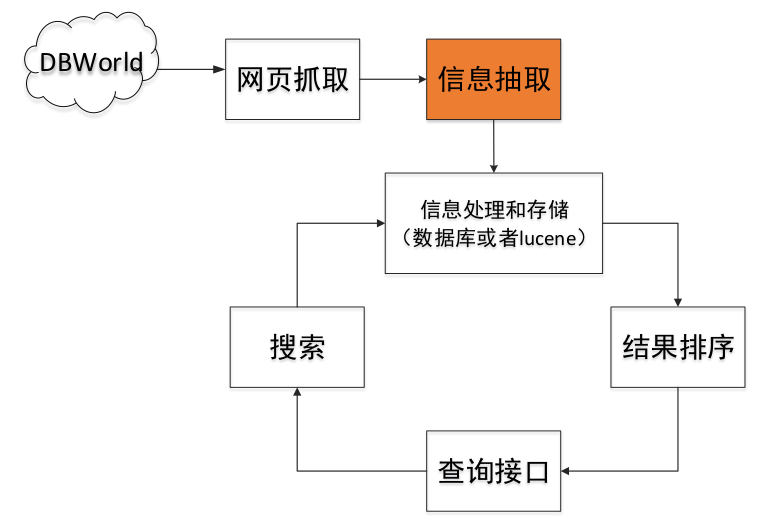
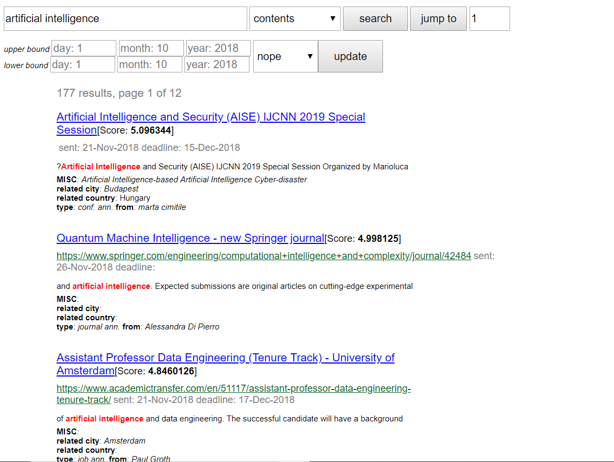
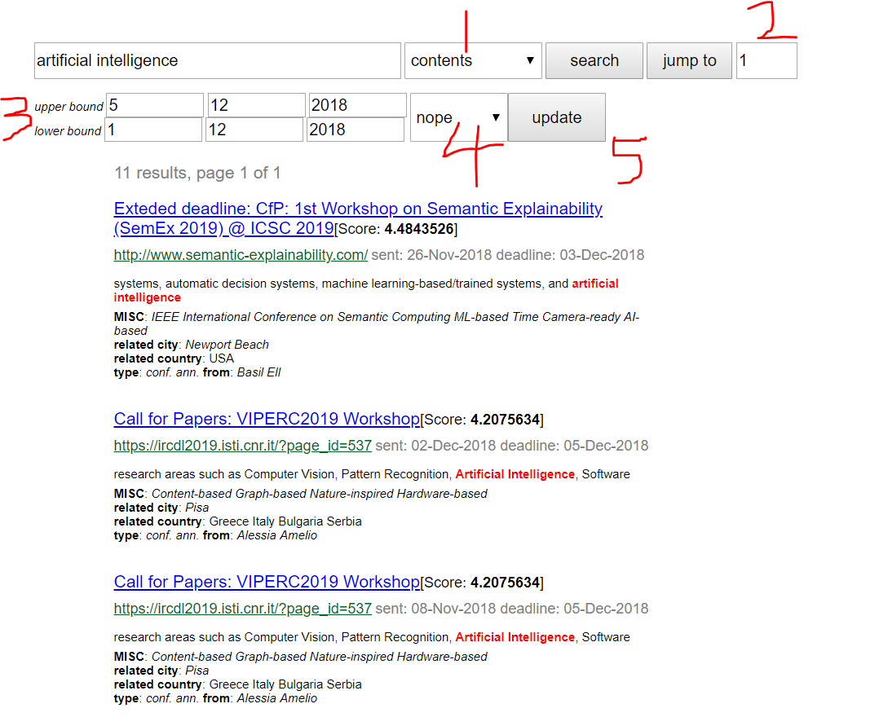
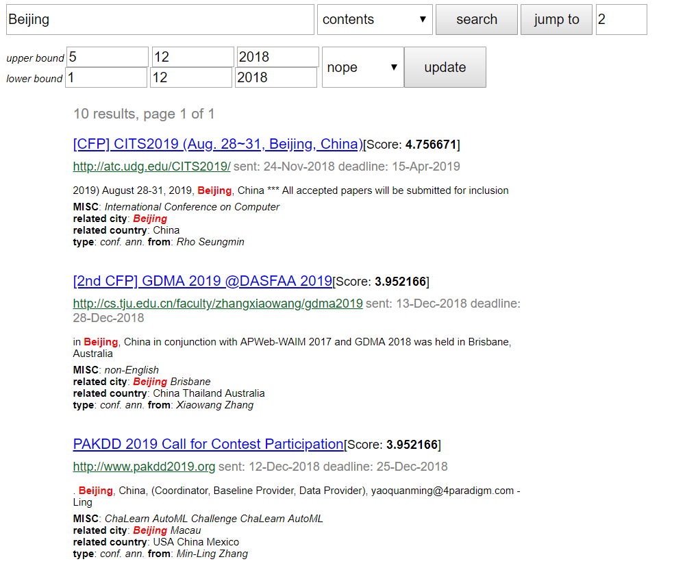

# **简单的搜索引擎实现**

## **实验内容**

 本实验是开发出面向DBWorld实时信息的灵活、 多功能的搜索引擎 本次实验的内容主要包括以下几部分：
1. 针对研究人员对DBWorld的信息搜索需求，设计了一个DBWorld 搜索引擎，给出总体设计
2. 针对DBWorld原始数据的特点，对DBWolrd进行信息抽取，包括 DBWorld网页中的地点、时间、主题等信息
3. 实现了一个基于WEB的DBWolrd搜索引

##### 爬取[DBWorld](https://research.cs.wisc.edu/dbworld/browse.html)

爬虫定时抓取更新

##### 信息抽取

[Stanford CoreNLP](https://stanfordnlp.github.io/CoreNLP/) 

DBWorld网页中的地点、时间、主题等信

##### 对搜索结果进行ranking

##### 基于web的搜索引擎

[参考网页](http://dbis-group.uni-muenster.de/dbms/templates/conferences/conferences.php)

使用jsp实现简单的搜索界面

多种搜索选项，包括提交截止日期，会议起止日期，地点，主题等

#### 实验拓展

- 会议重要性
  - 根据会议重要性(参考[ccf推荐会议](https://www.ccf.org.cn/xspj/gyml/ ))排序 

- 用户相关 
  - 实现用户登录注册功能 
  - 根据用户信息，搜索结果优先返回用户领域相关文章

- 相关词搜索
- 结果多页显示




## **实验环境**

编程语言：java

编程环境：windows 10

运行环境：java 8

使用工具：eclipse ee 

## **实验步骤及方法**

主要分成如下几个部分：爬虫、信息抽取、索引、搜索、界面展示，下面分别展示

### 爬虫

`ProcessMainPage.java`

java爬虫库比较多，由于需要爬取的内容结构很简单，所以只需要使用一个比较便于操作的、不需要太高的自定义的内容即可。选择`webmagic`.

通过文件的传递，从爬虫数据，到抽取数据，到建立索引的原始数据，可能会出现不同步的情况，于是需要建立某种记录的文件，如下：

```
mainPage.data 表示当前已爬取的url/filename
mainPage2.data 需要使用entityMention处理的file
mainPage3.data 已经被entityMention处理完但还没有建立索引的file
```

基本的抽取使用`webmagic`给出的官方教程稍微改进即可，使用`xpath`来制定内容，并且使用chrome来查找相应元素的`xpath`是很方便的。

将抽取的内容，使用下面会提到的`json`格式写入。为了便于后续的处理，将所有的内容都放入文件，包含：

```
name, sent, type, from, subject, url, deadline, webPage, contents
```

爬虫过程可以单独进行，也可以在`jsp`界面一键`update`

### 信息抽取

`EntityMention.java`

使用的是Stanford CoreNLP, 这个库还是比较强大的，除了某些非常消耗资源和有些慢。

由于NLP本身就比较复杂，强行抽取`topic`和`location`要不就是准确率很低，要么召回率很低，所以只做了NER.

官方给出的NER部分包含如下内容：

```
(12 classes) 
named (PERSON, LOCATION, ORGANIZATION, MISC), 
numerical (MONEY, NUMBER, ORDINAL, PERCENT),
temporal (DATE, TIME, DURATION, SET) 

(additional)(11 classes)
EMAIL, URL, CITY, STATE_OR_PROVINCE, COUNTRY, NATIONALITY, RELIGION, (job) TITLE, IDEOLOGY, CRIMINAL_CHARGE, CAUSE_OF_DEATH 

total: 23 classes.
```

由于并不清楚后期会用到哪些部分，所以全部抽取放在`json`文件里。

信息抽取过程可以单独进行，也可以在`jsp`界面一键`update`

### 索引

`Indexer.java`

由于使用了最新的`lucene`所以网上的中英文非官方档案均不合格，必须直接看文档。主要架构在官方文档上很详细，建立索引的原始文件即上面爬取的文件和信息抽取后得到的内容。

索引的内容包括

```
sent, type, from, subject, url, deadline, webPage, contents, CITY, MISC, COUNTRY
```

大部分都是使用`TextField`只有需要数字范围的`sent`与`deadline`使用了`IntPoint`这个需要深入官方文档才能找到。基本内容并不复杂。

另外，原文使用的日期格式为，`31-Dec-2018`使用字符串简单处理即可。

需要强调的是，没有对`topic`做特别的抽取，所以，直接将全部原文做索引，这样虽然有可能降低准确率，但是绝对不可能漏掉任何一项重要会议，相比与强行抽取更优。

索引过程可以单独进行，也可以在`jsp`界面一键`update`

### 搜索

`Searcher.java`

搜索与索引是配合的，无需多言。

由于搜索使用了多种模式，比如使用原文搜索，标题搜索，配合ddl时间范围，所以有多种模式。

除此之外，还对匹配的原文使用了高亮，使用`html`标签即可。

### 界面展示

`index.jsp, result.jsp`

使用`tomcat`部署，由于`maven`上的`tomcat`版本太老，所以直接在官网下载。

主体部分是`result.jsp`. 基本也就是设计几个按钮，使用`out.print()`来输出内容，然后设计了翻页和历史记录，具体参看源码清晰。

### 其他

1. 为了便于各种包的使用，使用`maven`建立工程，这一点使用`ecplise ee`还是比较容易的。只需要在`pom.xml`中添加相关库的标识符与版本即可。
2. 由于是一层一层建立的程序，所以中间的很多数据使用`json`来传递，所以建立`JsonFile.java`来封装一些常用的操作，比如`writeFile,readFile`
3. 

## **实验结果说明及演示**

运行后浏览器打开`http://localhost:8080/webt/index.jsp`得到如下内容


其中，`1`来输入内容，`2`来选择何种信息。得到的内容如下：



对内容作如下的解释


1. 网页的标题（点入是dbworld的纯文本）
2. 得分，网页排名
3. 原始网页（点入是原始网页）
4. 给出的sent与deadline时间
5. 匹配的一段内容，注意到匹配的`artificial intelligence`部分的红亮显示
6. 其他的信息，比如`related city,related country,type,from,MISC`

另外还有其他的信息搜索方式


解释如下

1. 选择搜索的方式，

   ```
   contents, subject, MISC,related city, related country, nope
   ```

   选择`nope`时表示不使用内容搜索，而只使用时间区间

2. 页面跳转

3. 选择日期的上下界

4. 选择日期的使用方式

   ```
   nope, deadline, sent
   ```

   其中使用`nope`表示仅仅使用上面的内容搜索，不使用日期区间。

   `deadline`表示会议的截至时间，`sent`表示发送时间

5. 即一键`update`由于`dbworld`的内容会不断更新，所以搜索引擎需要更新，这个比较慢，包含了爬虫、信息抽取、建立索引。

下面使用地点信息，比如北京



可以看到原文与`related city`部分均高亮了。

另外还包含了历史记录，在最下面

 

## **实验总结**

### 亮点

1. 纯`java`实现，完全按照文档标准
2. 仿google界面展示，清晰展示
3. 各类信息抽取，准确率高
4. 各类信息搜索，包括标题、内容、城市、国家，同时含有时间限界，便于信息过滤
5. 一键`update`及时更新内容

### 不足

1. 没有完全实现NLP内容

## **Ref**

### 环境与要求

#### Java环境搭建

~~解压实验文档内的jdk与eclipse的内容安装即可~~

##### win10

###### Reference

[参考1](https://www.cnblogs.com/yangyxd/articles/5615965.html)tomcat 路径按照上面的。建maven web工程按照下面的。

[eclipse ee web maven](https://wiki.base22.com/btg/how-to-create-a-maven-web-app-and-deploy-to-tomcat-fast-27033760.html)

###### 基于maven的web project建立

a. 安装最新JDK SE

b. 再安装最新eclipse jee

c. 下载最新的tomcat解压

d. 建立最新maven project. 

| name       | value   |
| ---------- | ------- |
| Archetype  | web     |
| groupId    | cn.drdh |
| artifactId | webtt   |

目录说明

- main 目录下是项目的主要代码，test 目录下存放测试相关的代码。 
- 编译输出后的代码会放在target 目录下（该目录与 src 目录在同一级别下，这里没有显示出来）。 
- java 目录下存放 Java 代码，resources 目录下存放配置文件。 
- webapp 目录下存放 Web 应用相关代码。 
- pom.xml 是 Maven 项目的配置文件

e. 然后按照[参考1](https://www.cnblogs.com/yangyxd/articles/5615965.html)即可

f. 其他内容预计可以使用maven自动下载以来

##### archlinux

```bash
yaourt eclipse-jee
```


### 预备知识

#### eclipse自动import+o

```
Ctrl+Shift+o
```

#### maven

[maven那些事](https://my.oschina.net/huangyong/blog/194583)

#### 爬虫

##### 依赖

```xml
<dependency>
    <groupId>us.codecraft</groupId>
    <artifactId>webmagic-core</artifactId>
    <version>0.7.3</version>
</dependency>
<dependency>
    <groupId>us.codecraft</groupId>
    <artifactId>webmagic-extension</artifactId>
    <version>0.7.3</version>
</dependency>
```

##### 入门

[WebMagic](http://webmagic.io/docs/zh/)

[webmajic入门](https://www.cnblogs.com/justcooooode/p/7913365.html)

###### log4j配置

在resource目录下新建log4j.properties文件

```properties
log4j.rootLogger=INFO, stdout

log4j.logger.org.quartz=WARN, stdout
log4j.appender.stdout=org.apache.log4j.ConsoleAppender
log4j.appender.stdout.layout=org.apache.log4j.PatternLayout
log4j.appender.stdout.layout.ConversionPattern=%d{MM-dd HH:mm:ss}[%p]%m%n
```

###### xpath

[xpath 教程](https://zhuanlan.zhihu.com/p/29436838)

###### java文件读写

[java文件读写](https://www.cnblogs.com/qianbi/p/3378466.html)

[如何将一个Java对象写到文件里](https://blog.csdn.net/zhencheng20082009/article/details/62422678)

[java 读写json](https://www.cnblogs.com/not-NULL/p/5235378.html)

[JSONObejct 遍历](https://blog.csdn.net/changhenshui1990/article/details/69950663)

```xml
<dependency>
    <groupId>org.json</groupId>
    <artifactId>json</artifactId>
    <version>20180813</version>
</dependency>
```

[String to json in java](https://stackoverflow.com/questions/5245840/how-to-convert-jsonstring-to-jsonobject-in-java)

###### java 集合

[Java中的Set集合类](https://my.oschina.net/xsh1208/blog/464995)

[Java Map集合的详解](https://blog.csdn.net/qq_33642117/article/details/52049764)

[HashMap遍历](https://blog.csdn.net/tjcyjd/article/details/11111401)

[java int与integer的区别](https://www.cnblogs.com/shenliang123/archive/2011/10/27/2226903.html)

[set的三种遍历方式，set遍历元素](https://blog.csdn.net/sunrainamazing/article/details/71577893)

###### Java String处理

[String split](http://www.runoob.com/java/java-string-split.html)

[String2int](https://stackoverflow.com/questions/5585779/how-do-i-convert-a-string-to-an-int-in-java)

[String 去除空格](https://blog.csdn.net/Further_way/article/details/73122139)

#### lucene

##### 依赖

```xml
<dependency>
    <groupId>org.apache.lucene</groupId>
    <artifactId>lucene-core</artifactId>
    <version>7.5.0</version>
</dependency>
<dependency>
    <groupId>org.apache.lucene</groupId>
    <artifactId>lucene-analyzers-common</artifactId>
    <version>7.5.0</version>
</dependency>
<dependency>
    <groupId>org.apache.lucene</groupId>
    <artifactId>lucene-queryparser</artifactId>
    <version>7.5.0</version>
</dependency>
<dependency>
    <groupId>org.apache.lucene</groupId>
    <artifactId>lucene-analyzers-smartcn</artifactId>
    <version>7.5.0</version>
</dependency>
<dependency>
    <groupId>org.apache.lucene</groupId>
    <artifactId>lucene-highlighter</artifactId>
    <version>7.5.0</version>
</dependency>
```

##### Reference

[Apache Lucene全文检索引擎架构](https://blog.csdn.net/eson_15/article/category/6301481)

[Lucene 学习笔记](https://blog.csdn.net/maonian1762/article/category/7599003)

[StringField与TextField对比](https://blog.csdn.net/john1337/article/details/62424286?locationNum=8&fps=1)

[lucene 学习](https://blog.csdn.net/u014449866/article/category/3245029)

[lucene各系列](https://blog.csdn.net/m0_37556444/article/category/8061470)

#### [CoreNLP](https://stanfordnlp.github.io/CoreNLP/)

##### 依赖

```xml
<dependencies>
<dependency>
    <groupId>edu.stanford.nlp</groupId>
    <artifactId>stanford-corenlp</artifactId>
    <version>3.9.1</version>
</dependency>
<dependency>
    <groupId>edu.stanford.nlp</groupId>
    <artifactId>stanford-corenlp</artifactId>
    <version>3.9.1</version>
    <classifier>models</classifier>
</dependency>
</dependencies>
```

##### 内存爆炸

[官方说明](https://nlp.stanford.edu/software/parser-faq.shtml#k)

[eclipse 修改方式](https://blog.csdn.net/qa962839575/article/details/43605241)

```
-Xmx6144M
```

##### Tutorial

[Stanford CoreNLP Tutorial](https://interviewbubble.com/stanford-corenlp-tutorial/)重点看Geting Start的1,2

#### JSP

[简单美化](https://blog.csdn.net/faintling/article/details/1879042)