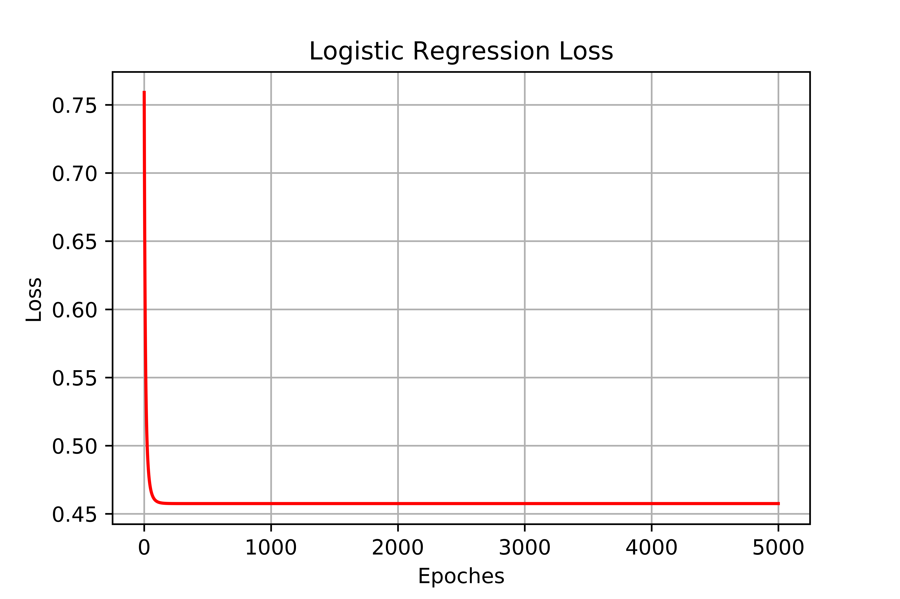
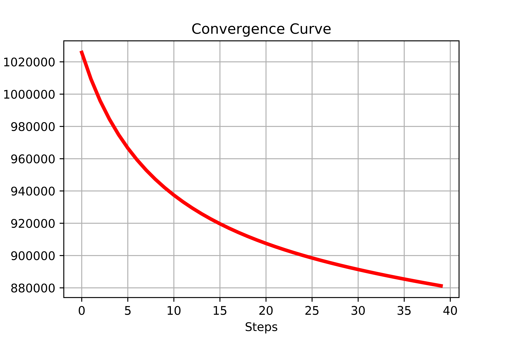
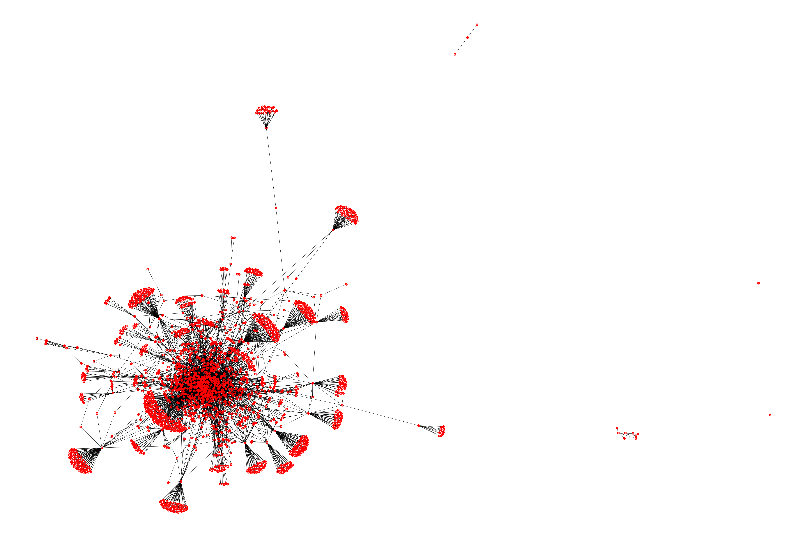
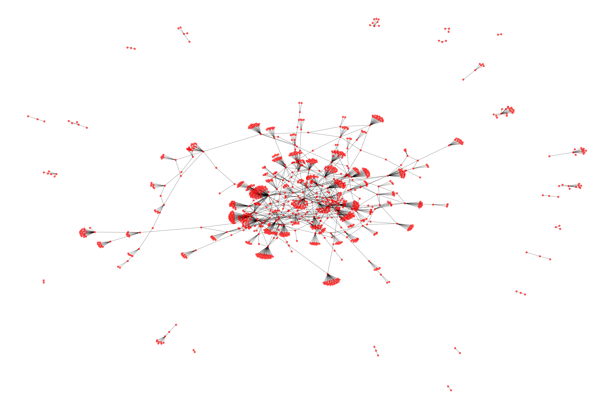
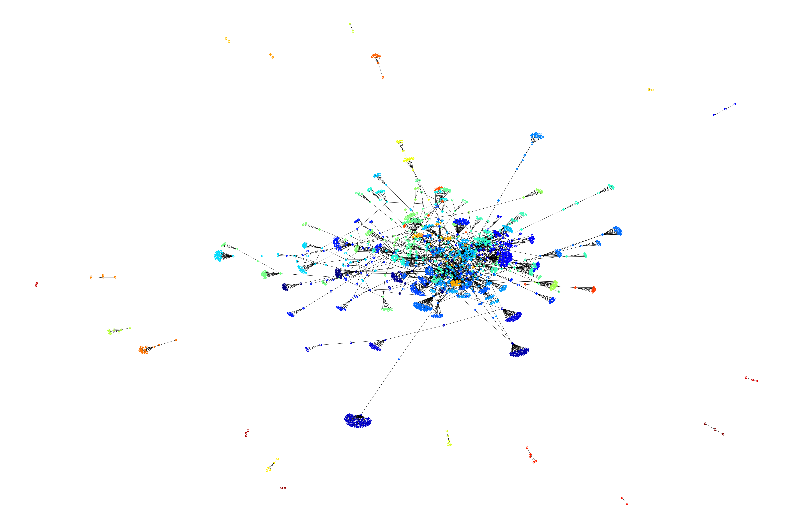
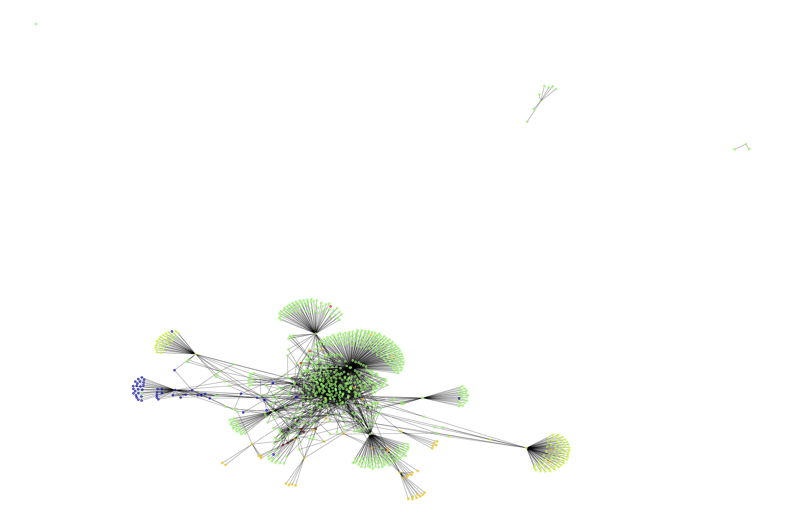
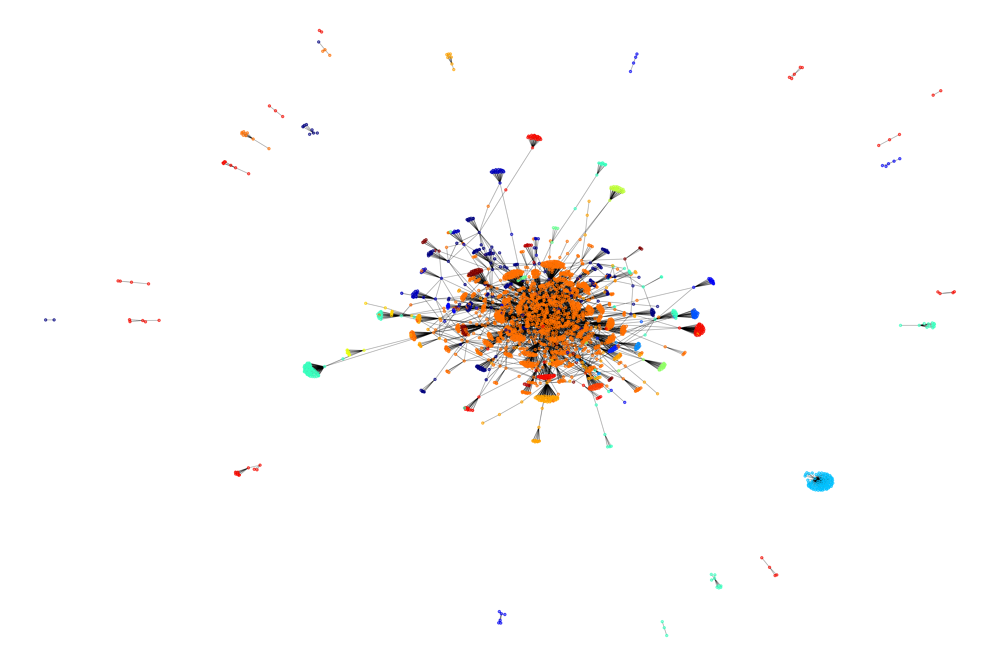
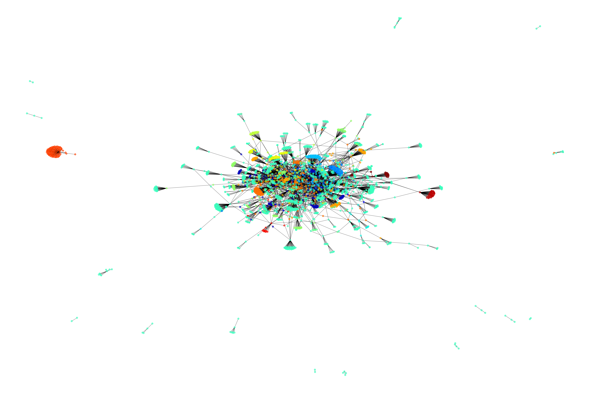

# 环境

```
OS: Manjaro 18.0.2 Illyria
Kernel: x86_64 Linux 4.19.13-1-MANJARO
python 3.7
numpy 1.15
matplotlib 3.0.2
networkx 2.2
jupyter 4.4.0
```

**注**：以下的程序划分仅仅是为了符合格式，实际的代码运行使用jupyter notebook. 程序为`Lab2.ipynb`打开后使用`Kernel-->Restart & Run All`。所以查看代码请使用jupyter notebook打开相应codes文件夹中的`src.ipynb`文件，格式更加清晰。

# Part I

- 董恒 PB16111545

## 数据描述

选用的数据为[Gas sensors for home activity monitoring Data Set](https://archive.ics.uci.edu/ml/datasets/Gas+sensors+for+home+activity+monitoring)

这个数据集是在不同的环境(background/banana/wine)中，计量8个感受器的测量值。以及另外附加的温度和湿度感受器。

总共的实例大小为919438，属性选择8个sensor的测量数据。

本实验的目的是由几个感受器测量的数据判断是属于哪个环境，为了简便起见，仅仅选用banana/wine的二分类任务。

## 预处理

1. 读取数据。这一点由于数据集本身的格式比较简单，所以可以直接使用`np.loadtxt`

   ```python
   metadata=np.loadtxt("./data/HT_Sensor_UCIsubmission/HT_Sensor_metadata.dat",skiprows=1,dtype=str)
   dataset = np.loadtxt('./data/HT_Sensor_UCIsubmission/HT_Sensor_dataset.dat', skiprows=1)
   ```

2. 将文字表述的类别改成数字。

3. 选定特定时间区间的数据。

   这是由于本身给定的数据是先在空环境中测量，然后放入特定的物品，然后过一段时间撤掉物品。所以有效的时间区间就是那段放入特定物品的区间。预处理可以是使用`matadata`给出的时间描述来抽取。

4. 随机化。

   由于测量的数据，是按照某种时间顺序来记录的，所以需要将数据随机化，避免过度的关联。

   ```python
   np.random.shuffle(data)
   ```

5. 归一化。

   由于不同的感受器测量得到的数据并不是统一在某个区间，而是相对于自身的数据有不同的偏重。所以归一化能避免不同的度量大小对数据的影响。

   ```python
   data=(data-data.mean(axis=0))/data.std(axis=0)
   ```

6. 划分训练集和测试集；这一点我放在了KNN/Logistic Regression的部分

   ```python
   X_test=data[:test_size,2:10]
   y_test=data[:test_size,0].astype('int')
   
   X_train=data[test_size:,2:10]
   y_train=data[test_size:,0].astype('int')
   
   print(X_test.shape,y_test.shape,X_train.shape,y_train.shape,data.shape)
   ```

## KNN

1. 算法

   划分的训练集已知其label,然后对测试集中的每个点，都计算它与训练集中点的距离，然后找到最近的k个，来判断属于哪一个。

   ```pseudocode
   for x in test_X:
   	NN={distance(x,t) for t in train_x}
   	kNN=NN.min(k)
   	x.label=kNN.most_common_label
   ```


   ```python
   class KNN():
       def __init__(self, k=5):
           self.k = k
   
       def predict(self, X_test, X_train, y_train):
           y_pred=np.empty(X_test.shape[0],dtype=int)
           for i,X in enumerate(X_test):
               if i%100 ==0:
                   print(i)
               y_pred[i]=np.bincount(y_train[np.argsort(np.linalg.norm(X-X_train,axis=1))[:self.k]]).argmax()
           return y_pred
   ```

   使用`numpy`还是比较简单的矩阵计算。

2. 结果

   由于数据集过于庞大，KNN测试非常非常慢，而且得到的结果非常准确。在使用k=3，仅仅测试1000的点，准确率达到100%. 于是决定减小训练集为整个数据集的1/2, 然后将k=1, 相当于最临近邻居。这样测试集数量减小了，而且训练速度更快了，但还是整整跑了一个中午。最后得到的结果如下。

   预测的代码为

   ```python
   model=KNN(1)
   y_pred=model.predict(X_test[:],X_train[:],y_train)
   result=Counter(np.equal(y_pred[:],y_test[:])).most_common()
   print(result)
   ```

   结果为

   ```python
   [(True, 41638), (False, 7)]
   ```

   可以说准确率非常高，又鉴于测试速度过于缓慢，就没有必要继续往下测试。

## Logistic Regression

1. 算法

   具体算法也就是对$\frac{1}{1+e^{-w^\top x}}$求一个loss函数，然后使用梯度下降，最终得到一个更新w的式子为
   $$
   \mathbf{w}=\mathbf{w}+\alpha \sum_{i=1}^N \Bigg[\Big( y_i-\sigma( \mathbf{w}^\top  \mathbf{x}_i)\Big)  \mathbf{x}_i  \Bigg]
   $$
   最终得到的算法为

   ```pseudocode
   initialize(W)
   while not converge:
   	W=updata_according_to_the_formula_above(W)
   ```


   ```python
   LOSS=[]
   class LogisticRegression():
       def __init__(self,lr=0.1):
           self.lr=lr
           
       def sigmoid(self,Z):
           return 1/(1+np.exp(-Z))
       
       def loss(self,y,y_hat):
           return -np.mean(y * np.log(y_hat)+(1-y)*np.log(1-y_hat))
       
       def fit(self,X_train,y_train,epochs=5000):
           limit=1/math.sqrt(X_train.shape[1])
           self.W=np.random.uniform(-limit,limit,(X_train.shape[1],))
           
           for i in range(epochs):
               y_hat=self.sigmoid(X_train @ self.W)
               self.W -= self.lr * (X_train.T @ (y_hat - y_train) / y_train.shape[0])
               temp_loss=self.loss(y_train,y_hat)
               LOSS.append((i,temp_loss))
               if i %100 ==0:
                   print(i,temp_loss)
                   
       def predict(self,X_test):
           y_pred=self.sigmoid(X_test @ self.W)>0.5
           return y_pred.astype('int')
   ```

2. 结果

   Logistic Regression得到的结果不理想。

   迭代5000次，得到的结果为

   ```python
   model=LogisticRegression(0.25)
   model.fit(X_train,y_train,5000)
   y_pred=model.predict(X_test)
   
   Counter(y_pred == y_test).most_common()
   ```

   最终的结果为

   ```python
   [(True, 28829), (False, 12816)]
   ```

   准确率为69.23%

   另外得到的损失函数的大小为

   

   可以看到基本上已经没有下降的空间了，证明训练已经完全。

## 结果讨论

1. KNN的准确度明显比Logistic Regression(LR)高很多很多
2. KNN的测试速度比LR慢很多。这是由于KNN要与训练集中的每个点来计算距离，然后得到结果，而LR仅仅计算一个函数，参数都训练出来的。
3. 可以猜想KNN的准确率很高的原因是与每个点比较，已经完全获知了分类的信息。而LR在本实验中仅仅只有8个参数，完全不足以划分数据集，或者说，数据集本身并不能用一个超平面划分出来。这一点联想到深度学习，也许可以用多层的$w$参数来拟合分类。

# Part I-Again

## 数据描述

选用的数据为[**Electrical Grid Stability Simulated Data Data Set** ](https://archive.ics.uci.edu/ml/datasets/Electrical+Grid+Stability+Simulated+Data+)

这个数据集是探究在4个节点的星状供电网络的稳定性问题。

总共的实例大小为10000，属性为11个，然后一个label表明是稳定还是不稳定。

本实验的目的是预测在给定属性的条件下，系统是否稳定。

## 预处理

1. 读取数据。这一点由于数据集本身的格式比较简单，所以可以直接使用`np.loadtxt`

   ```python
   data=np.loadtxt("./data/PartI/Data_for_UCI_named.csv",delimiter=",",skiprows=1,dtype=str)
   #"tau1","tau2","tau3","tau4","p1","p2","p3","p4","g1","g2","g3","g4","stab","stabf"
   #0       1      2       3     4    5    6    7    8     9   10   11   12     13
   
   data=data[:,[0,1,2,3,5,6,7,8,9,10,11,12]].copy()
   #"tau1","tau2","tau3","tau4","p2","p3","p4","g1","g2","g3","g4","stab",
   #   0     1     2      3      4    5    6    7    8    9    10   11
   ```

2. 随机化。

   由于测量的数据，是按照某种时间顺序来记录的，所以需要将数据随机化，避免过度的关联。

   ```python
   np.random.shuffle(data)
   ```

3. 归一化与划分数据集

   由于不同的属性值并不是统一在某个区间，而是相对于自身的数据有不同的偏重。所以归一化能避免不同的度量大小对数据的影响。

   划分为X/y(abel)

   ```python
   X=data[:,:11].copy().astype("float")
   y=data[:,11].astype("float")>0
   X=(X-X.mean(axis=0))/X.std(axis=0)
   
   np.save("./data/PartI/X.npy",X)
   np.save("./data/PartI/y.npy",y)
   ```

## KNN

1. 算法

   划分的训练集已知其label,然后对测试集中的每个点，都计算它与训练集中点的距离，然后找到最近的k个，来判断属于哪一个。

   ```pseudocode
   for x in test_X:
   	NN={distance(x,t) for t in train_x}
   	kNN=NN.min(k)
   	x.label=kNN.most_common_label
   ```


   ```python
   class KNN():
       def __init__(self, k=5):
           self.k = k
   
       def predict(self, X_test, X_train, y_train):
           y_pred=np.empty(X_test.shape[0],dtype=int)
           for i,X in enumerate(X_test):
               if i%100 ==0:
                   print(i)
               y_pred[i]=np.bincount(y_train[np.argsort(np.linalg.norm(X-X_train,axis=1))[:self.k]]).argmax()
           return y_pred
   ```

   使用`numpy`还是比较简单的矩阵计算。

2. 结果

   首先随机定一个k=3得到的结果如下。

   预测的代码为

   ```python
   model=KNN(3)
   y_pred=model.predict(X_test[:],X_train[:],y_train)
   result=Counter(np.equal(y_pred[:],y_test[:])).most_common()
   print(result)
   ```

   结果为

   ```
   [(True, 802), (False, 198)]
   ```

   为了更加明确得到k的值对分类的影响，对不同的K做预测代码如下：

   ```python
   plt.figure(1)
   plt.plot(range(1,52,2),[i[0][1]/1000 for i in result],'r')
   #plt.plot(range(1,52,2),[i[1][1]for i in result],'g')
   plt.title("KNN Precision of K")
   plt.ylabel("Precision")
   plt.xlabel("K")
   plt.grid(True)
   plt.savefig("./graph/PartI/KNN_Precision.png",dpi=1000)
   plt.show()
   ```

   得到的结果如下

   

   所以大概取k=19能得到比较好的效果。

## Logistic Regression

1. 算法

   具体算法也就是对$\frac{1}{1+e^{-w^\top x}}$求一个loss函数，然后使用梯度下降，最终得到一个更新w的式子为
   $$
   \mathbf{w}=\mathbf{w}+\alpha \sum_{i=1}^N \Bigg[\Big( y_i-\sigma( \mathbf{w}^\top  \mathbf{x}_i)\Big)  \mathbf{x}_i  \Bigg]
   $$
   最终得到的算法为

   ```pseudocode
   initialize(W)
   while not converge:
   	W=updata_according_to_the_formula_above(W)
   ```


   ```python
LOSS=[]
class LogisticRegression():
    def __init__(self,lr=0.1):
        self.lr=lr
        
    def sigmoid(self,Z):
        return 1/(1+np.exp(-Z))
    
    def loss(self,y,y_hat):
        return -np.mean(y * np.log(y_hat)+(1-y)*np.log(1-y_hat))
    
    def fit(self,X_train,y_train,epochs=5000):
        limit=1/math.sqrt(X_train.shape[1])
        self.W=np.random.uniform(-limit,limit,(X_train.shape[1],))
        
        for i in range(epochs):
            y_hat=self.sigmoid(X_train @ self.W)
            self.W -= self.lr * (X_train.T @ (y_hat - y_train) / y_train.shape[0])
            temp_loss=self.loss(y_train,y_hat)
            LOSS.append((i,temp_loss))
            if i %100 ==0:
                print(i,temp_loss)
                
    def predict(self,X_test):
        y_pred=self.sigmoid(X_test @ self.W)>0.5
        return y_pred.astype('bool')
   ```

OS: Manjaro 18.0.2 Illyria
Kernel: x86_64 Linux 4.19.13-1-MANJARO
python 3.7
numpy 1.15
matplotlib 3.0.2
networkx 2.2
jupyter 4.4.0
注：以下的程序划分仅仅是为了符合格式，实际的代码运行使用jupyter notebook. 程序为Lab2.ipynb打开后使用Kernel-->Restart & Run All。所以查看代码请使用jupyter notebook打开相应codes文件夹中的src.ipynb文件，格式更加清晰。

Part I
董恒 PB16111545

数据描述
选用的数据为Gas sensors for home activity monitoring Data Set

这个数据集是在不同的环境(background/banana/wine)中，计量8个感受器的测量值。以及另外附加的温度和湿度感受器。

总共的实例大小为919438，属性选择8个sensor的测量数据。

本实验的目的是由几个感受器测量的数据判断是属于哪个环境，为了简便起见，仅仅选用banana/wine的二分类任务。

预处理
读取数据。这一点由于数据集本身的格式比较简单，所以可以直接使用np.loadtxt


metadata=np.loadtxt("./data/HT_Sensor_UCIsubmission/HT_Sensor_metadata.dat",skiprows=1,dtype=str)
dataset = np.loadtxt('./data/HT_Sensor_UCIsubmission/HT_Sensor_dataset.dat', skiprows=1)
将文字表述的类别改成数字。

选定特定时间区间的数据。

这是由于本身给定的数据是先在空环境中测量，然后放入特定的物品，然后过一段时间撤掉物品。所以有效的时间区间就是那段放入特定物品的区间。预处理可以是使用matadata给出的时间描述来抽取。

随机化。

由于测量的数据，是按照某种时间顺序来记录的，所以需要将数据随机化，避免过度的关联。


np.random.shuffle(data)
归一化。

由于不同的感受器测量得到的数据并不是统一在某个区间，而是相对于自身的数据有不同的偏重。所以归一化能避免不同的度量大小对数据的影响。


data=(data-data.mean(axis=0))/data.std(axis=0)
划分训练集和测试集；这一点我放在了KNN/Logistic Regression的部分


X_test=data[:test_size,2:10]
y_test=data[:test_size,0].astype('int')
​
X_train=data[test_size:,2:10]
y_train=data[test_size:,0].astype('int')
​
print(X_test.shape,y_test.shape,X_train.shape,y_train.shape,data.shape)
KNN
算法

划分的训练集已知其label,然后对测试集中的每个点，都计算它与训练集中点的距离，然后找到最近的k个，来判断属于哪一个。


for x in test_X:
    NN={distance(x,t) for t in train_x}
    kNN=NN.min(k)
    x.label=kNN.most_common_label

   class KNN():
       def __init__(self, k=5):
           self.k = k
   
       def predict(self, X_test, X_train, y_train):
           y_pred=np.empty(X_test.shape[0],dtype=int)
           for i,X in enumerate(X_test):
               if i%100 ==0:
                   print(i)
               y_pred[i]=np.bincount(y_train[np.argsort(np.linalg.norm(X-X_train,axis=1))[:self.k]]).argmax()
           return y_pred
   使用numpy还是比较简单的矩阵计算。

结果

由于数据集过于庞大，KNN测试非常非常慢，而且得到的结果非常准确。在使用k=3，仅仅测试1000的点，准确率达到100%. 于是决定减小训练集为整个数据集的1/2, 然后将k=1, 相当于最临近邻居。这样测试集数量减小了，而且训练速度更快了，但还是整整跑了一个中午。最后得到的结果如下。

预测的代码为


model=KNN(1)
y_pred=model.predict(X_test[:],X_train[:],y_train)
result=Counter(np.equal(y_pred[:],y_test[:])).most_common()
print(result)
结果为


[(True, 41638), (False, 7)]
可以说准确率非常高，又鉴于测试速度过于缓慢，就没有必要继续往下测试。

Logistic Regression
算法

具体算法也就是对​求一个loss函数，然后使用梯度下降，最终得到一个更新w的式子为

最终得到的算法为


initialize(W)
while not converge:
    W=updata_according_to_the_formula_above(W)

   LOSS=[]
   class LogisticRegression():
       def __init__(self,lr=0.1):
           self.lr=lr
           
       def sigmoid(self,Z):
           return 1/(1+np.exp(-Z))
       
       def loss(self,y,y_hat):
           return -np.mean(y * np.log(y_hat)+(1-y)*np.log(1-y_hat))
       
       def fit(self,X_train,y_train,epochs=5000):
           limit=1/math.sqrt(X_train.shape[1])
           self.W=np.random.uniform(-limit,limit,(X_train.shape[1],))
           
           for i in range(epochs):
               y_hat=self.sigmoid(X_train @ self.W)
               self.W -= self.lr * (X_train.T @ (y_hat - y_train) / y_train.shape[0])
               temp_loss=self.loss(y_train,y_hat)
               LOSS.append((i,temp_loss))
               if i %100 ==0:
                   print(i,temp_loss)
                   
       def predict(self,X_test):
           y_pred=self.sigmoid(X_test @ self.W)>0.5
           return y_pred.astype('int')
结果

Logistic Regression得到的结果不理想。

迭代5000次，得到的结果为


model=LogisticRegression(0.25)
model.fit(X_train,y_train,5000)
y_pred=model.predict(X_test)
​
Counter(y_pred == y_test).most_common()
最终的结果为


[(True, 28829), (False, 12816)]
准确率为69.23%

另外得到的损失函数的大小为



可以看到基本上已经没有下降的空间了，证明训练已经完全。

结果讨论
2. 结果

   Logistic Regression得到的结果不理想。

   迭代5000次，得到的结果为

   ```python
   model=LogisticRegression(0.25)
   model.fit(X_train,y_train,5000)
   y_pred=model.predict(X_test)
   
   Counter(y_pred == y_test).most_common()
   ```

   最终的结果为

   ```python
   [(True, 762), (False, 238)]
   ```

   另外得到的损失函数的大小为

   

   可以看到基本上已经没有下降的空间了，证明训练已经完全。

## 结果讨论

1. KNN在实例比较多的情况下，效果会比较好，但是预测的速度很慢。Logistic Regression的预测速度很快，但是它的参数$\mathbf{w}$的大小会成为它的限制。
2. KNN的测试速度比LR慢很多。这是由于KNN要与训练集中的每个点来计算距离，然后得到结果，而Logistic Regression仅仅计算一个函数，参数都训练出来的。
3. 可以猜想KNN的准确率很高的原因是与每个点比较，已经完全获知了分类的信息。而Logistic Regression在本实验中仅仅只有是几个参数，完全不足以划分数据集，或者说，数据集本身并不能用一个超平面划分出来。

# Part II-1

## 人员

- 董恒 PB16111545
- 张抑淼 PB16111543
- 张莎 PB16111042

## 预处理

1. 对ratings的预处理如下

   - 抽取成numpy格式

     ```python
     ratings=np.loadtxt("./data/ml-1m/ratings.dat",delimiter="::",dtype=int)
     ```

   - 然后获取相关的`rating_matrix`

     ```python
     user_num=6040
     movie_num=3952
     rating_matrix=np.zeros((6040+1,3952+1))
     for r in ratings:
         rating_matrix[r[0],r[1]]=r[2] #rating_matrix[userID,movieID]
     ```

   - 分割成训练集和测试集

     ```python
     # 分割为train & test
     train_matrix=rating_matrix.copy()
     test_user_size=rating_matrix.shape[0]//10
     test_movie_size=rating_matrix.shape[1]//10
     
     train_matrix[:test_user_size,:test_movie_size]=0
     
     test_matrix=rating_matrix[:test_user_size,:test_movie_size].copy()
     
     print(train_matrix.shape,test_matrix.shape,rating_matrix.shape)
     ```

2. 对movies的预处理如下

   - 从txt中抽取数据

     ```python
     movies=np.zeros((movie_num+1,3),dtype="<100U")
     with open("./data/ml-1m/movies.dat",encoding = "ISO-8859-1") as f:
         line=f.readline()
         while line:
             temp=line.strip().split("::")
             movies[int(temp[0]),:]=temp
             line=f.readline()
     ```

   - 将genre改成int类型的标识符

     ```python
     movie_profile=np.zeros((movie_num+1,18))
     for i in range(movie_num+1):
         temp=movies[i,2].split('|')
         for g in temp:
             if g in genre:
                 movie_profile[i,genre[g]]=1
     ```

## Content-Based Methods

1. 算法描述

   由于仅有ratings矩阵可供使用，所以现在假定item profile $\mathbf{i}$为电影评分向量。而user profile $\mathbf{x}$为$\mathbf{i}$的加权平均和，权重为评分的值。然后所得到的预测值为
   $$
   5\times \frac{\mathbf{x}\cdot\mathbf{i}}{||\mathbf{x}||\cdot||\mathbf{i}||}
   $$
   伪代码为

   ```python
   cb_pred=np.zeros((test_user_size,test_movie_size))
   for i in range(1,test_user_size):
       for j in range(1,test_movie_size):
           norm=np.linalg.norm(train_matrix[:,j])*np.linalg.norm(user_profile[i])
           if norm == 0:
               cb_pred[i,j]=0
           else:
               cb_pred[i,j]=((train_matrix[:,j]@user_profile[i])/(norm))*5
   ```

2. 评价。

   使用4种方式进行评价：RMSE, MAE, Precision, Recall

   其中
   $$
   RMSE=\sqrt{\frac{1}{n}\sum_{j=1}^n (y_j-\bar{y}_j)^2}
   $$

   $$
   MAE=\frac{1}{n}\sum_{j=1}^n|y_j-\bar{y}_j|
   $$

   而Precison和Recall使用了TopN的概念，也就是推荐N个，使用的度量方式是，推荐系统推荐的为排名在前N的电影，而ground truth选择评分大于3的电影。

   需要强调的是，由于用户仅仅给出了部分电影的得分，有些电影并没有得分，所以在计算RMSE和MAE的值时候，需要把那些原本就没有评分的值去掉，这些值并不知道是否用户会喜欢。

   同样对于Precison和Recall值，确实可以推荐那些没有看过的电影，但是这样也没法判断是否推荐正确了，所以仍然需要去除。

   最终的计算方式为

   ```python
   result_matrix2=cb_pred.copy()
   result_matrix2[test_matrix==0]=0
   result_matrix=result_matrix2-test_matrix
   
   #RMSE
   RMSE=np.linalg.norm(result_matrix)/np.count_nonzero(test_matrix)
   #MAE
   MAE=np.sum(np.absolute(result_matrix))/np.count_nonzero(test_matrix)
   N=10 #TopN
   recommend_rate=3
   pred=np.argsort(result_matrix2,axis=1)[:,-N:]
   #truth=np.argsort(test_matrix,axis=1)[:,-N:]
   
   Total_Right=0
   index=np.arange(test_movie_size)
   for i in range(test_user_size):
       #Total_Right+=np.intersect1d(pred[i],truth[i]).shape[0]
       
       Total_Right+=np.intersect1d(pred[i],index[test_matrix[i]>recommend_rate]).shape[0]
       
   precision=Total_Right/(N*test_user_size)
   recall=Total_Right/test_matrix[test_matrix>recommend_rate].shape[0]
   
   ```

   下面的几个方法的评测方式类似，不再详细给出代码。

   在这样的定义下得到的结果如下(N=10)

   ```
   RMSE=0.016676901400536383
   MAE=1.4344089529739494
   Precision=0.4870860927152318 
   Recall=0.49628879892037786
   ```

   为了判断不同的N对于Precison 和Recall以及F1值的影响，做了另外的测试。得到的结果如下

   

   可以发现正好差不多是10的时候就兼顾了Precison和Recall

## Collaborative Filtering Methods

1. 算法描述

   这里使用的算法为PPT给出的

   

   相应的伪代码过程为

   > 1. 计算item相似性movie_sim[i,j]
   >
   >    公式为
   >    $$
   >    Sim_{ij}=\frac{\sum_{x\in S_{ij}}(r_{xi}-\bar{r}_i)(r_{xj}-\bar{r}_j)}{\sqrt{\sum_{x\in S_{ij}}(r_{xi}-\bar{r}_i)^2(r_{xj}-\bar{r}_j)^2}}
   >    $$
   >    其中$S_{ij}$为同时给$i,j$评分过的人，$r_{xi}$表示用户$x$给电影$i$的评分，$\bar{r}_i$为电影$i$得分的平均分
   >
   > 2. 计算用户$x$对未知的$i$的得分，公式为
   >    $$
   >    r_{xi}=b_{xi}+\frac{\sum_{j\in N(i;x)}Sim_{ij}(r_{xj}-b_{xj})}{\sum_{j\in N(i;x)}Sim_{ij}}
   >    $$
   >    其中各种符号的定义见上面的PPT

2. 评测

   依然使用上面提到的4种方法，得到的结果为

   ```
   RMSE=0.010776504401721263
   MAE=0.8694166710904666
   Precision=0.46589403973509935 
   Recll=0.47469635627530365
   ```

   同样为了比较不同的TopN的N值对结果的影响，另做额外的测试，得到结果如下

   

   通过上面的数据可以看到，CF的结果与CB结果相近。也同样得出了使用N=10比较均衡的结论。

## Improved Methods

1. 初衷

   注意到数据集还有其他的数据可以使用 ，比如电影的流派/种类，于是，可以考虑使用流派建立用户的profile，然后来预测。

2. 算法

   算法本身是基于Collaborative Filtering的，巨大的不同点在于如下的公式
   $$
   r_{xi}=b_{xi}+(1-\alpha)\frac{\sum_{j\in N(i;x)}Sim_{ij}(r_{xj}-b_{xj})}{\sum_{j\in N(i;x)}Sim_{ij}}+\alpha \text{LIKE}(x,i)
   $$
   其中$\alpha$为预先设定的参数，相当于权重。而$\text{LIKE}(x,i)$表示用户$x$对$i$的喜爱程度，这里同样使用了movie_profile和user_profile, 不同点在于，movie_profile使用18个电影流派的one-hot码的加权表示，而user_profile使用movie的profile向量的加权和来表示。

   > 1. 计算movie_sim[i,j]与CF相同
   >
   > 2. 计算movie_profile[movie_num,18]使用one-hot码的加权和
   >
   >    ```python
   >    movie_profile=np.zeros((movie_num+1,18))
   >    for i in range(movie_num+1):
   >        temp=movies[i,2].split('|')
   >        for g in temp:
   >            if g in genre:
   >                movie_profile[i,genre[g]]=1
   >    ```
   >
   > 3. 计算user_profile, 使用movie_profile的加权和(权重为给电影的评分)
   >
   >    ```python
   >    user_profile=np.zeros((test_user_size,18))
   >    for i in range(test_user_size):
   >        user_profile[i]=np.sum(movie_profile.T*train_matrix[i],axis=1)
   >    ```
   >
   > 4. 根据上面的公式计算$r_{xi}$. 

3. 测试

   初始随机选定$\alpha=0.01$, 得到的结果如下

   ```
   RMSE=0.01077113454270768
   MAE=0.8700781457473302
   Precision=0.46589403973509935 
   Recall=0.47469635627530365
   ```

   对比可以看到有很小的改进，但几乎可以忽略不计。

   上面使用了预先设定的参数$\alpha$,于是理所当然需要测试不同的值对结果的影响。于是现在逐步缩小区间，得到一系列的值，选定的区间为[0,1]/[0,0.08]/[0,0.04]得到结果如下

   

   所以可以看到结果是取$\alpha=0.05$结果会比较好。但事实上改进的很小。这也有可能是Collaborative Filtering方法已经发掘了比较多的信息，再使用基于流派的信息得到的额外信息并不是很多，也有另外的一种解释是：某个用户喜欢看某种流派的东西，并不代表他喜欢这种电影流派所有的东西，也有一些不好的电影会给很差的评分。所以如果需要取得更好的结果，就需要更加细致化的用户/流派/电影建模。这一点在下面的基于矩阵分解的方法中有一些涉及。

## CB与CF方法的优缺点

1. CB

   Pros

   - 不需要使用其他用户的数据，没有cold-start或稀疏性的问题
   - 能够给用户推荐个性化的东西
   - 能够推荐比较新以及不是流行的东西。没有first-rater的问题
   - 能够提供一定的解释。

   Cons

   - 找到合适的features很困难。比如images/movies/music
   - 过于特性化。从来不推荐其他用户也喜欢的东西。一个用户也可能有多种兴趣。
   - 对于新用户，没办法给出profile

2. CF

   Pros

   - 对于任何的item都适合，不用提前选定features

   Cons

   - Cold Start. 需要足够多的用户数据才能推荐。
   - 稀疏性问题。矩阵很稀疏的话，就很难找到相似的用户或者电影
   - First Rater. 不能去推荐那些还没有评分的电影
   - 容易推荐流行的东西而不是个性化的东西

## 调研-推荐系统的冷启动问题

**1. 冷启动问题定义**

> 推荐系统需要根据用户的历史行为和兴趣预测用户未来的行为和兴趣，对于BAT这类大公司来说，它们已经积累了大量的用户数据，不发愁。但是对于很多做纯粹推荐系统的网站或者很多在开始阶段就希望有个性化推荐应用的网站来说，如何在对用户一无所知（即没有用户行为数据）的情况下进行最有效的推荐呢？这就衍生了冷启动问题。

**2. 冷启动的分类**

冷启动问题主要分为3类：

- **用户冷启动**，即如何给新用户做个性化推荐
- **物品冷启动**，即如何将新的物品推荐给可能对它感兴趣的用户
- **系统冷启动**，即如何在一个新开发的网站（没有用户，没有用户行为，只有部分物品信息）上设计个性化推荐系统，从而在网站刚发布时就让用户体会到个性化推荐

**3. 冷启动问题的解决方案**

**3.1 提供非个性化的推荐**

最简单的例子就是提供热门排行榜，可以给用户推荐热门排行榜，等到用户数据收集到一定的时候，再切换为个性化推荐。Netflix的研究也表明新用户在冷启动阶段确实是更倾向于热门排行榜的，老用户会更加需要长尾推荐。

**3.2 利用用户注册信息**

用户的注册信息主要分为3种：

- 人口统计学信息，包括年龄、性别、职业、民族、学历和居住地
- 用户兴趣的描述，部分网站会让用户用文字来描述兴趣
- 从其他网站导入的用户站外行为，比如用户利用社交网站账号登录，就可以在获得用户授权的情况下导入用户在该社交网站的部分行为数据和社交网络数据。

这种个性化的粒度很粗，假设性别作为一个粒度来推荐，那么所有刚注册的女性看到的都是同样的结果，但是相对于男女不区分的方式，这种推荐精度已经大大提高了。

**3.3 选择合适的物品启动用户的兴趣**

用户在登录时对一些物品进行反馈，收集用户对这些物品的兴趣信息，然后给用户推荐那些和这些物品相似的物品。一般来说，能够用来启动用户兴趣的物品需要具有以下特点：

- 比较热门，如果要让用户对物品进行反馈，前提是用户得知道这是什么东西；
- 具有代表性和区分性，启动用户兴趣的物品不能是大众化或老少咸宜的，因为这样的物品对用户的兴趣没有区分性；
- 启动物品集合需要有多样性，在冷启动时，我们不知道用户的兴趣，而用户兴趣的可能性非常多，为了匹配多样的兴趣，我们需要提供具有很高覆盖率的启动物品集合，这些物品能覆盖几乎所有主流的用户兴趣。

**3.4 利用物品的内容信息**

物品冷启动问题在新闻网站等时效性很强的网站中非常重要，因为这些网站时时刻刻都有新物品加入，而且每个物品必须能够再第一时间展现给用户，否则经过一段时间后，物品的价值就大大降低了。

对UserCF算法来说，针对推荐列表并不是给用户展示内容的唯一列表（大多网站都是这样的）的网站。当新物品加入时，总会有用户通过某些途径看到，那么当一个用户对其产生反馈后，和他历史兴趣相似的用户的推荐列表中就有可能出现该物品，从而更多的人对该物品做出反馈，导致更多的人的推荐列表中出现该物品。

因此，该物品就能不断扩散开来，从而逐步展示到对它感兴趣用户的推荐列表中针对推荐列表是用户获取信息的主要途径（例如豆瓣网络电台）的网站UserCF算法就需要解决第一推动力的问题，即第一个用户从哪儿发现新物品。最简单的方法是将新的物品随机战士给用户，但是太不个性化。因此可以考虑利用物品的内容信息，将新物品先投放给曾经喜欢过和它内容相似的其他物品的用户。

对ItemCF算法来说，物品冷启动就是很严重的问题了。因为该算法的基础是通过用户对物品产生的行为来计算物品之间的相似度，当新物品还未展示给用户时，用户就无法产生行为。为此，只能利用物品的内容信息计算物品的相关程度。基本思路就是将物品转换成关键词向量，通过计算向量之间的相似度（例如计算余弦相似度），得到物品的相关程度。

**3.5 采用专家标注**

很多系统在建立的时候，既没有用户的行为数据，也没有充足的物品内容信息来计算物品相似度。这种情况下，很多系统都利用专家进行标注。

代表系统：个性化网络电台Pandora、电影推荐网站Jinni。

以Pandora电台为例，Pandora雇用了一批音乐人对几万名歌手的歌曲进行各个维度的标注，最终选定了400多个特征。每首歌都可以标识为一个400维的向量，然后通过常见的向量相似度算法计算出歌曲的相似度。

## Extended Methods

1. 原理

   这里使用的方法是带正则化的评分矩分解。也就是
   $$
   R_{m\times n}\approx P_{m\times k}\times Q_{k\times n}=\hat{R}_{m\times n}
   $$
   应用到评分矩阵上，可以解释为，$P_{m\times k}$为用户$m$对流派$k$的喜爱值，$Q_{k\times n}$为流派$k$对于电影$n$的推荐系数。然后使用一系列的梯度下降法得到迭代的式子，同时为了防止过拟合加上正则项。最终得到的矩阵分解的代码为

   ```python
   def matrix_factorization(R,P,Q,K,steps=5000,alpha=0.0002,beta=0.02):
       Q=Q.T  # .T操作表示矩阵的转置
       result=[]
       for step in range(steps):
           print(step)
           for i in range(len(R)):
               for j in range(len(R[i])):
                   if R[i][j]>0:
                       eij=R[i][j]-np.dot(P[i,:],Q[:,j]) # .dot(P,Q) 表示矩阵内积
                       for k in range(K):
                           P[i][k]=P[i][k]+alpha*(2*eij*Q[k][j]-beta*P[i][k])
                           Q[k][j]=Q[k][j]+alpha*(2*eij*P[i][k]-beta*Q[k][j])
           eR=np.dot(P,Q)
           e=0
           for i in range(len(R)):
               for j in range(len(R[i])):
                   if R[i][j]>0:
                       e=e+pow(R[i][j]-np.dot(P[i,:],Q[:,j]),2)
                       for k in range(K):
                           e=e+(beta/2)*(pow(P[i][k],2)+pow(Q[k][j],2))
           result.append(e)
           if e<0.001:
               break
       return P,Q.T,result
   ```

2. 测试

   由于k的强烈含义，这里设置$k=18$, 同时由于迭代的速度实在是太慢了，大概一分钟一轮迭代，所以设置迭代次数为40, 同时得到loss的收敛曲线为


   

   可以看到接近收敛了，但是没有完全。

   得到的结果如下

   ```
   RMSE=0.009260923901617401 
   MAE=0.7447313937537074 
   Precision=0.4995033112582781 
   Recall=0.5089406207827261
   ```

   对比CF的结果

   ```
   # RMSE 0.010776504401721263
   # MAE 0.8694166710904666
   # P 0.46589403973509935 
   # R 0.47469635627530365
   ```

   可以看到还是有比较明显的提高的，特别是在Precision(同比增长7.21%),Recall(7.21%)

   需要注意的是，这里仅仅是欠拟合的结果，考虑到时间问题，没有再继续运行，但是可以猜测，完全收敛后得到的解肯定有更大的提高。

# Part II-2

## 人员

- 董恒 PB16111545
- 张抑淼 PB16111543
- 张莎 PB16111042

## Graph Visualization

1. 数据预处理

   这里需要从txt文档建立得到一个网络。

   建立的思路是读入文件，去除无关紧要的符号，按照人名(全部小写化)索引，由此需要3个步骤

   - 无关信息的去除

     ```python
     for i in line:
         if i!='\n':
             s=i.strip("\t\n 1234567890*^:").lower()
             if s=="erdos, peter l.":
                 count+=1
             else:
                 temp.append(s)
         else:
             data.append(temp)
             temp=[]
     data.append(temp)
     ```

   - 名字到序号，序号到名字的映射的建立

     ```python
     name2seq=dict()
     count=0
     max_co=0
     for i in data:
         if len(i)>max_co:
             max_co=len(i)
         for j in i:
             if not j in name2seq:
                 name2seq[j]=count
                 count+=1
     name_num=len(name2seq)
     
     seq2name={}
     for i in name2seq.items():
         seq2name[i[1]]=i[0]
     ```

   - 网络的建立

     ```python
     graph=np.full((name_num,name_num),False)
     for i in data:
         x=name2seq[i[0]]
         for j in i[1:]:
             y=name2seq[j]
             graph[x,y]=True
             graph[y,x]=True
     ```

     注意到这里是个对称的无向图，所以需要另外设置另一个方向的值。

2. 同一种颜色图的建立

   这里的点数量实在是太多了，所以需要挑选出一些点来建立网络。

   - 使用前2000个节点的图

     

   - 使用前6000个节点的图

     

   - 使用随机的3000个点的图

     前面都是使用前面连续的点，由于建图的过程，连续的点之间相连的可能性比较大，所以为了反映出整个图的特性，同时也不会有过多的节点，现在随机选择3000个节点（已去除那些独立的点）

     

3. 使用Partition的图

   这里使用Commmunity库给出的划分来染色，注意这里使用的库仅仅用于当前的画图，目的是更加方便看出社区的关系，并不涉及到后面的社区发现以及染色。

   - 前1000节点的图

     

   - 前2000节点的图

     

   - 前3000节点的图

     

   - 随机4000节点的图

     基于上面同样的原因，这里使用随机的点以对整个社区有更好的认识

     

## Influence

1. 使用PPT上提到的3种影响力的计算方法

2. Degree Centrality

   ```python
   degree=graph.sum(axis=0)
   print(seq2name[degree.argmax()])
   ```

   也就是度数最大的是影响力最大的那个。得到的结果为`'alon, noga m.'`

3. Eigenvector Centrality

   这里的思想是，一个用户的影响力取决于与他相关的人的影响力，计算的方法也就是计算特征值最大的特征向量，那么影响力最大的是特征向量中值最大的那个

   ```python
   w2,v2=np.linalg.eigh(graph.astype("float"))
   seq2name[v2[:,w2.argmax()].argmax()]
   ```

   得到的结果依然是`'alon, noga m.'`

4. Closeness Centrality

   这里需要计算各个节点之间的距离，使用类似Bellman算法的近似算法，这是由于计算量实在是太大了，仅仅迭代10次，代码如下

   ```python
   D=np.full((name_num,name_num),name_num)
   D[graph]=1
   index=np.arange(name_num)
   for k in range(10):
       print("====== ",k," ======")
       for i in range(n):
           if i%1000==0:
               print(i)
           nextP=index[D[i]!=name_num]
           for j in range(n):
               for p in nextP:
                   D[i,j]=min(D[i,j],D[i,p]+D[p,j])
   ```

   最后也就是取到其它点距离和最小的那个

   ```python
   D_avg=(name_num-1)/(Distance.sum(axis=1))
   seq2name[D_avg.argmax()]
   ```

   得到的结果仍然是`'alon, noga m.'`

5. 注意到三种不同的方法得到的结果都是同一个人，简单搜索一下，会发现这个人出现了55次，可以说是最大那个，也就是除了Erdos本人外，在这个网络里影响最大的那个人。

## Community

1. 这里使用3种方法来实现社区发现。每一种 算法都会使用到KMeans, 本着造轮子的思想，KMeans实现如下

   ```python
   def kMeans(X, K, maxIters = 10, plot_progress = None):
       
       centroids = X[np.random.choice(np.arange(len(X)), K)]
       for i in range(maxIters):
           if i%100==0:
               print("Iter: ",i)
           # Cluster Assignment step
           C = np.array([np.argmin([np.dot(x_i-y_k, x_i-y_k) for y_k in centroids]) for x_i in X])
           # Ensure we have K clusters, otherwise reset centroids and start over
           # If there are fewer than K clusters, outcome will be nan.
           if (len(np.unique(C)) < K):
               print("Reset")
               centroids = X[np.random.choice(np.arange(len(X)), K)]
           else:
               # Move centroids step 
               centroids = [X[C == k].mean(axis = 0) for k in range(K)]
           if plot_progress != None: plot_progress(X, C, np.array(centroids))
       return np.array(centroids) , C
   ```

   基本思想也就是计算中心-按中心分类-迭代

2. RatioCut

   计算$D-W$的特征值和特征向量，选择最小的k个特征向量构成新的点描述向量$n\times k$， 然后使用kMeans对缩减后的向量空间聚类。

     ```python
   K=20 #K Clusters
   k=100 #n*k
   Miter=1000
   centroids_r,C_r=kMeans(v_r[:,np.argsort(w_r)[:k]], K, maxIters = Miter, plot_progress = None)
     ```

   顺便得到分类的各个簇的大小为

   ```python
   [(15, 7028),(0, 884),(17, 576), (14, 560), (8, 470), (19, 281), (7, 264), (1, 225), (6, 220), (16, 211), (2, 153), (9, 147), (4, 138), (18, 81), (10, 62), (11, 56), (3, 49), (5, 45), (13, 44), (12, 23)]
   ```

   然后使用这样的社区来可视化为

   - 前1000点

     

   - 前2000点

     

   - 随机4000点

     

   - 随机6000点

     

3. NormalizedCut

   方法与RatioCut类似，只不过这里计算的是$D^{-\frac{1}{2}}(D-W)D^{-\frac{1}{2}}$的特征值和特征向量

   划分结果为

   ```python
   [(5, 7447), (14, 717), (12, 528), (17, 480), (13, 423), (18, 378), (2, 309), (3, 202), (19, 160), (0, 133), (6, 118), (4, 117), (11, 94), (8, 92), (10, 88), (1, 87), (7, 82), (16, 29), (9, 20), (15, 13)]
   ```

   - 前2000节点

     

   - 随机6000节点

     

4. Modularity

   计算方法与上面的类似，仅仅是换成了求$B=A-dd^\top /2m$的特征向量和特征值

   得到的结果如下

   ```python
   [(8, 7255), (15, 776), (10, 522), (14, 476), (1, 364), (5, 353), (12, 235), (16, 221), (6, 193), (7, 180), (13, 166), (18, 130), (9, 109), (17, 100), (11, 95), (0, 92), (4, 90), (19, 82), (3, 67), (2, 11)]
   ```

   - 前2000节点

     

   - 随机6000节点

     

5. 直观可以看到这几种方法划分的效果都还可以，但是还是存在一些社区过大的问题。

   基本上划分的都将不同社区的点染上了不同的颜色。

6. 需要注意的是，这里至关重要的是选择k个特征向量以及分成K个Clusters，这两个参数的选取对结果的影响非常大，鉴于计算力有限，只选取了k=100以及K=10作为案例。更加科学的方法应当是使用某种度量划分的结果，然后选择不同的k/K值来得到最佳的结果。